## Arquitetura 802.1X

### Componentes

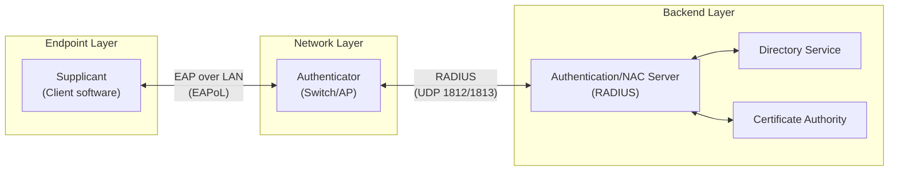

### Estado da porta

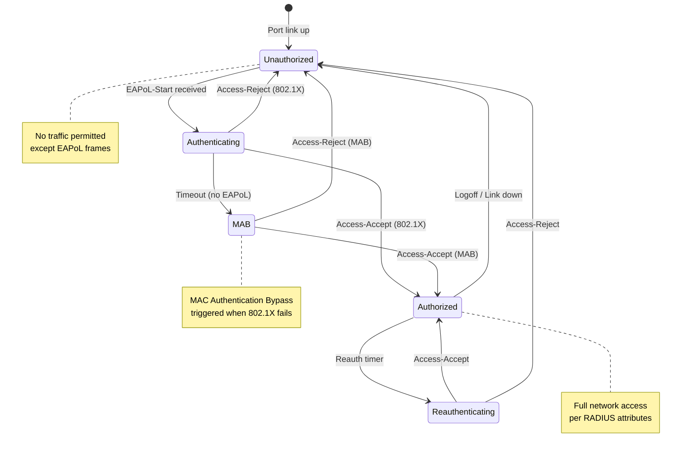

### Escolha do Método de Autenticação

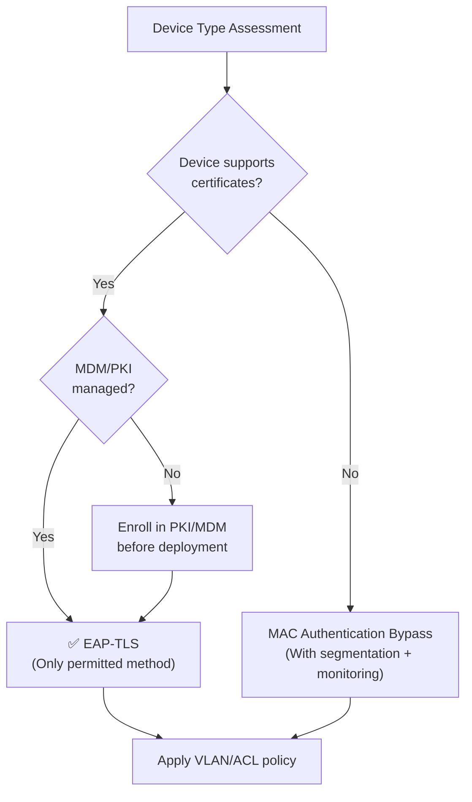

### Autenticação EAP-TLS

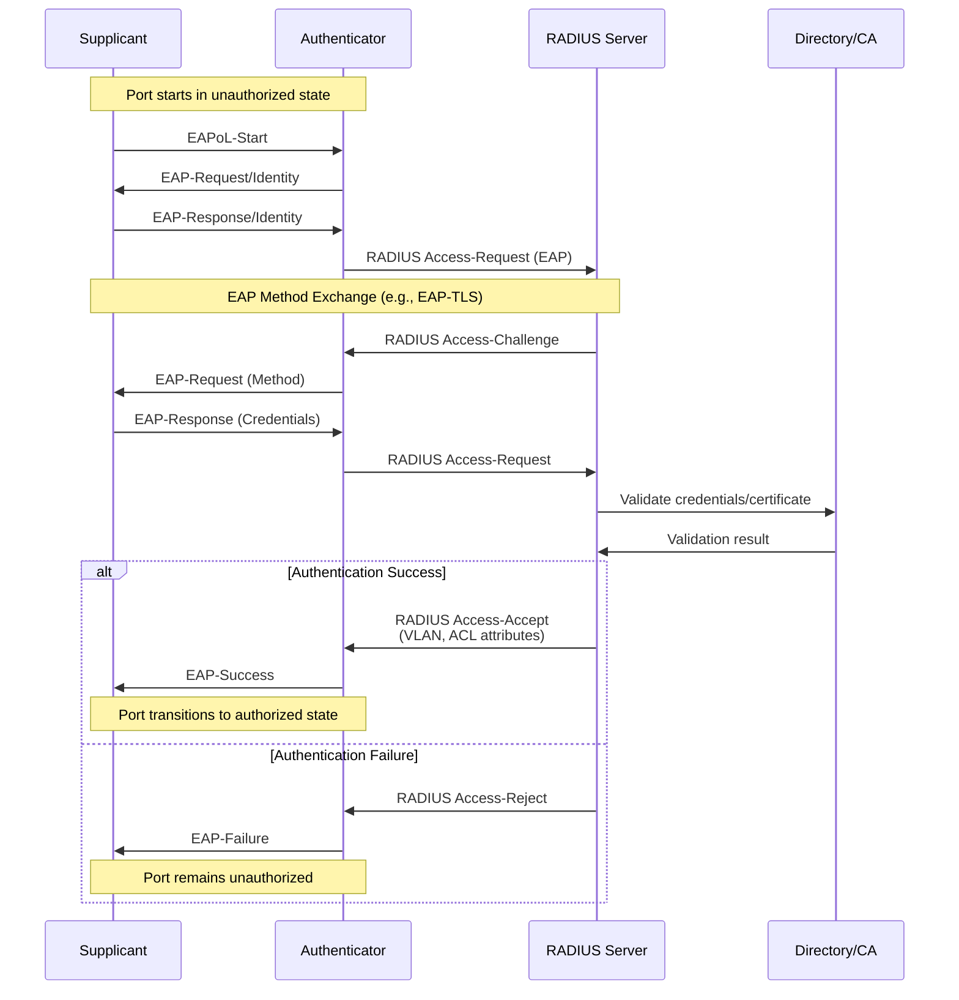

### MAC Authentication Bypass (MAB)

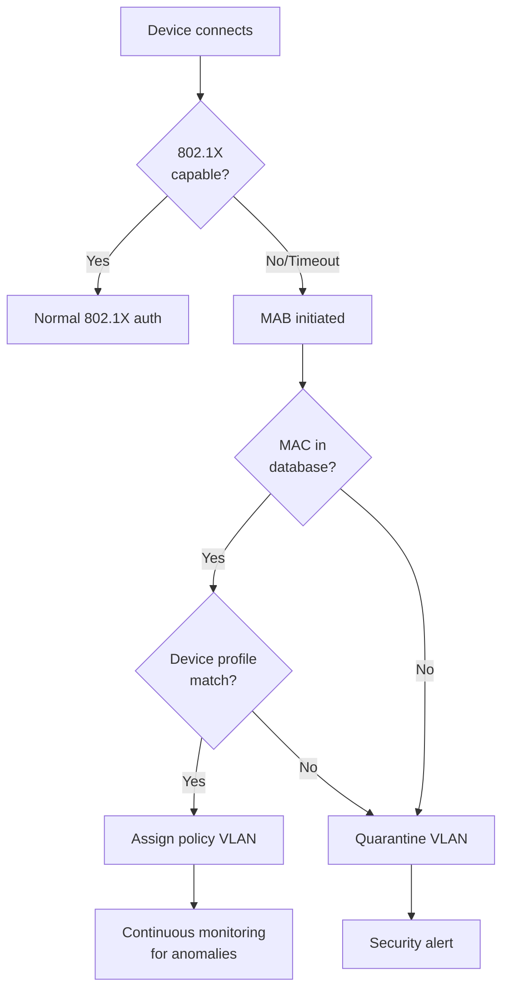

### MAB Configuration Requirements

| Setting | Value | Rationale |
|---------|-------|-----------|
| MAB timeout | 30 seconds after 802.1X timeout | Allow 802.1X attempt first |
| MAC format | Lowercase, hyphen-separated | Consistency |
| RADIUS attribute | Calling-Station-Id | MAC identification |
| Device profiling | Required | Validate device type |
| Re-profiling interval | 24 hours | Detect MAC spoofing |
| Unknown MAC policy | Deny or quarantine | Security default |

### MAB Use Cases

MAB provides network access for devices that cannot perform 802.1X authentication:

| Device Category | Examples | MAB Policy |
|-----------------|----------|------------|
| Network printers | Enterprise print devices | Registered MAC, printer VLAN |
| Building systems | HVAC, access control, elevators | Registered MAC, IoT VLAN |
| Medical devices | Monitors, diagnostic equipment | Registered MAC, restricted VLAN |
| AV equipment | Displays, projectors | Registered MAC, AV VLAN |
| Legacy systems | Older equipment without supplicant | Registered MAC, legacy VLAN |

## Arquitetura ISE / Redundância

### Redundant Deployment

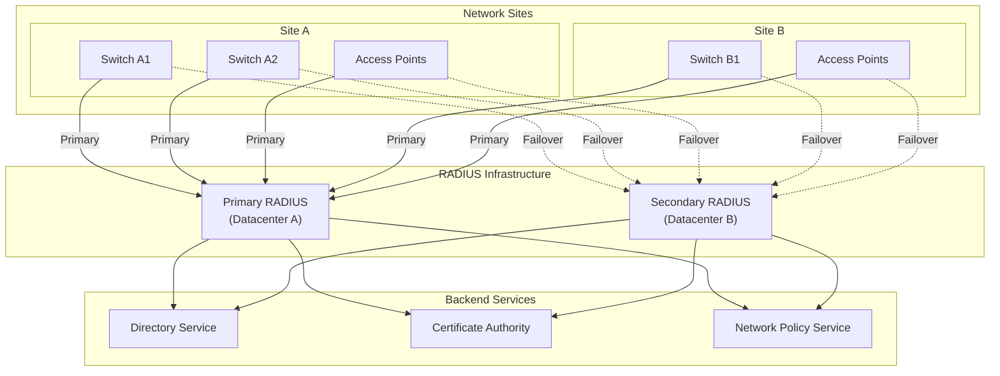

### RADIUS Attributes for Policy Enforcement

| Attribute | Number | Purpose | Example |
|-----------|--------|---------|---------|
| Tunnel-Type | 64 | VLAN assignment | VLAN |
| Tunnel-Medium-Type | 65 | Medium type | IEEE-802 |
| Tunnel-Private-Group-ID | 81 | VLAN ID/name | 20 |
| Filter-Id | 11 | ACL assignment | CORP-ACL |
| Session-Timeout | 27 | Reauth interval | 28800 (8 hours) |
| Termination-Action | 29 | Post-session action | RADIUS-Request |

## Wired 802.1X Implementation

### Switch Port Configuration Standards

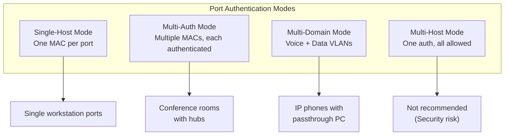

### Port Configuration Requirements

| Setting | Standard Value | Rationale |
|---------|---------------|-----------|
| Authentication mode | Multi-Domain (voice+data) or Multi-Auth | Support IP phones and conferencing |
| Host mode | Multi-auth preferred | Per-device authentication |
| Periodic reauthentication | Enabled, 8 hours | Session validation |
| Quiet period | 60 seconds | Retry delay after failure |
| Tx period | 30 seconds | EAP request interval |
| Supplicant timeout | 30 seconds | Client response timeout |
| Server timeout | 30 seconds | RADIUS response timeout |
| Maximum requests | 3 | Retry attempts |
| Guest VLAN | Enabled for designated ports | Unauthenticated access where required |
| Auth-fail VLAN | Enabled | Quarantine for failed auth |
| Critical VLAN | Enabled | Access when RADIUS unavailable |

### Port Exception Categories

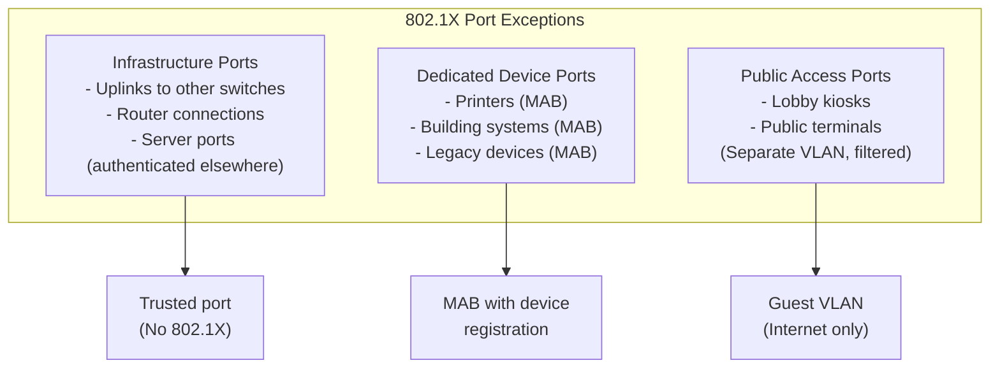

## Wireless 802.1X Integration

### Wireless-Specific Considerations

| Aspect | Wired | Wireless | Implication |
|--------|-------|----------|-------------|
| Physical port | One device per port | Multiple clients per AP | Use multi-auth mode on AP |
| Roaming | N/A | Client moves between APs | Fast BSS transition (802.11r) |
| Key management | EAPoL-Key | 4-way handshake + PMK caching | OKC/802.11r for fast roaming |
| Encryption | Optional (MACsec) | Required (WPA3) | Always encrypt wireless |

### Fast Roaming Support

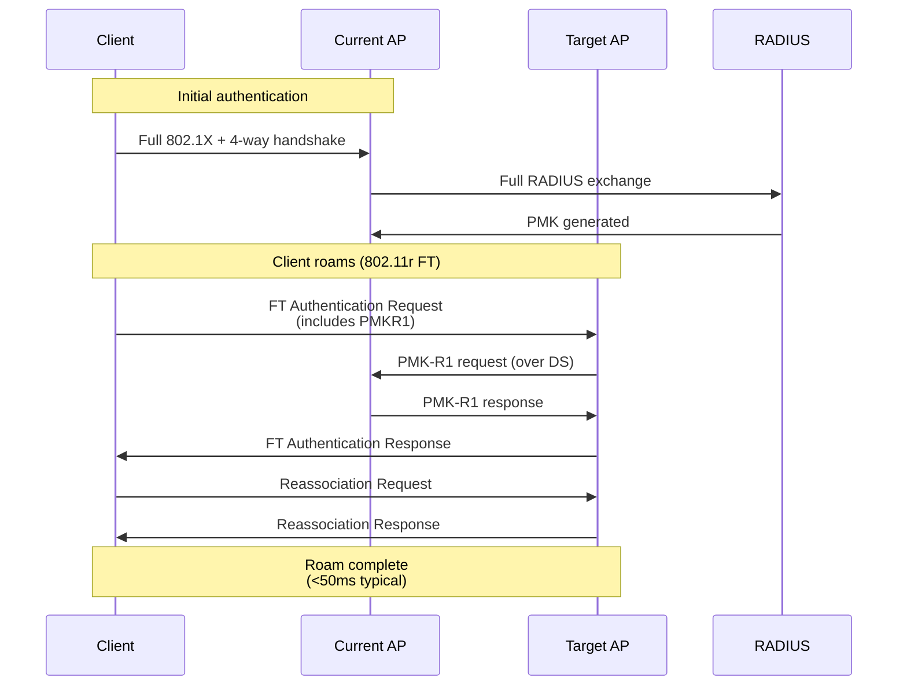

## Deployment Phases

### Phased Rollout Strategy

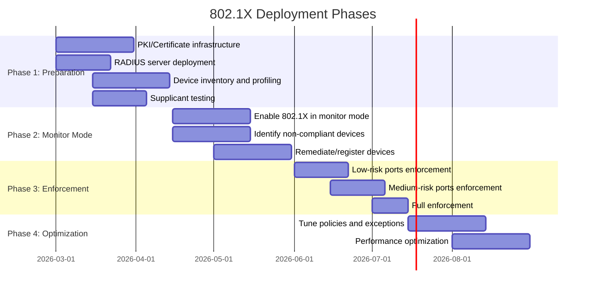

### Phase Descriptions

| Phase | Objective | Success Criteria |
|-------|-----------|------------------|
| **1. Preparation** | Build infrastructure, inventory devices | PKI operational, RADIUS redundant, 95% devices profiled |
| **2. Monitor Mode** | Identify authentication failures without blocking | <5% unknown devices, all failures categorized |
| **3. Enforcement** | Enable authentication requirement | <1% legitimate access failures, help desk trained |
| **4. Optimization** | Tune for performance and user experience | <500ms auth time, zero RADIUS outages |

## Industry Adoption Data

### Enterprise 802.1X Deployment Statistics

| Metric | Value | Source | Year |
|--------|-------|--------|------|
| Enterprise 802.1X adoption (wired) | 72% | EMA Network Access Control Report | 2024 |
| Enterprise 802.1X adoption (wireless) | 89% | EMA Network Access Control Report | 2024 |
| EAP-TLS usage (of 802.1X deployments) | 48% | SANS Network Security Survey | 2024 |
| PEAP/MSCHAPv2 usage | 38% | SANS Network Security Survey | 2024 |
| MAB for IoT devices | 67% | Ponemon IoT Security Study | 2024 |
| Average deployment time (enterprise) | 6-12 months | Industry benchmark | 2024 |

### Municipal and Government Adoption

| Sector | 802.1X Adoption | Notes |
|--------|-----------------|-------|
| Federal agencies (FISMA) | 94% | Mandated by NIST |
| State government | 78% | Growing requirement |
| Municipal (large cities) | 65% | Increasing adoption |
| Municipal (mid-size) | 42% | Cost barrier |
| K-12 education | 58% | E-Rate funded |

## Cost-Performance Analysis

### Implementation Costs

| Component | Initial Cost | Annual Cost | Notes |
|-----------|--------------|-------------|-------|
| RADIUS servers (2x HA) | $0-15,000 | $0-5,000 | Included with directory services or dedicated |
| Certificate Authority (internal) | $0 | $2,000-5,000 | PKI maintenance |
| Network Policy Server/NAC | $0-50,000 | $10,000-25,000 | Varies by sophistication |
| Supplicant software | $0 | $0 | Built into modern OS |
| Switch/AP 802.1X support | $0 | $0 | Standard feature |
| Staff training | $5,000-10,000 | $2,000 | Initial + ongoing |
| **Total (500 ports)** | **$5,000-75,000** | **$14,000-37,000** | — |
| **Per-port first year** | **$38-224** | — | Varies by existing infrastructure |

### Return on Investment

| Benefit | Estimated Annual Value | Basis |
|---------|------------------------|-------|
| Prevented unauthorized access | $25,000-250,000 | Industry breach costs |
| Reduced malware incidents | $15,000-100,000 | Lateral movement prevention |
| Compliance (CJIS, HIPAA, PCI) | Required | Audit findings prevention |
| Simplified access management | $10,000-30,000 | Automated provisioning |
| Network visibility | $5,000-20,000 | Device inventory accuracy |

### TCO Comparison: 802.1X vs. No NAC

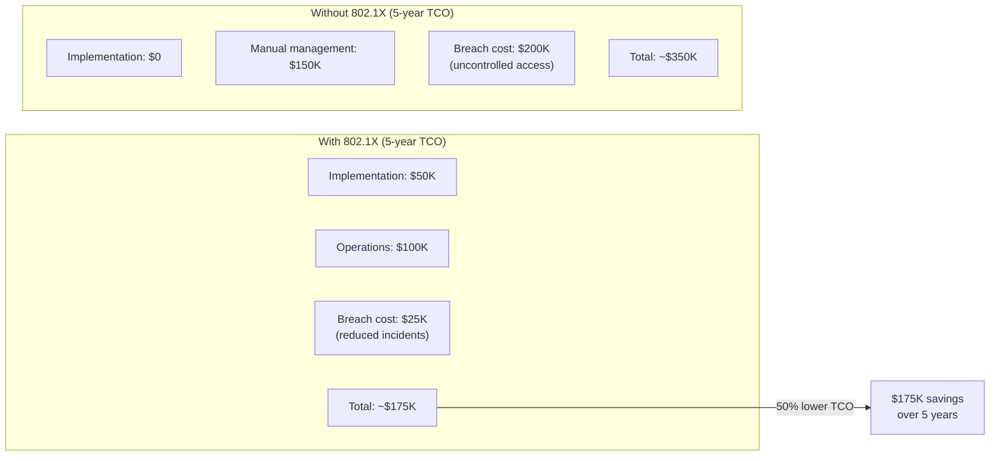

## Security Considerations

### Threat Mitigation

| Threat | Without 802.1X | With 802.1X |
|--------|----------------|-------------|
| Unauthorized device connection | Possible | Blocked at port |
| MAC spoofing | No detection | Limited by profiling |
| Rogue access points | Not controlled | Detected/blocked |
| Lateral movement | Unrestricted | VLAN isolation |
| Credential theft | Network-wide impact | Limited to authorized resources |
| Physical port abuse | Any device connects | Authentication required |

### MACsec Integration (IEEE 802.1AE)

For high-security environments, 802.1X can enable MACsec encryption:

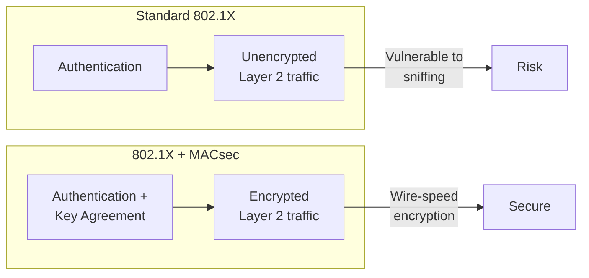

## NIST Alignment

### NIST SP 800-53 Control Mapping

| Control ID | Control Name | 802.1X Implementation |
|------------|--------------|----------------------|
| AC-3 | Access Enforcement | Port-based access control |
| AC-17 | Remote Access | VPN integration with 802.1X |
| AU-2 | Audit Events | RADIUS accounting logs |
| AU-3 | Content of Audit Records | Authentication success/failure details |
| IA-2 | Identification and Authentication | EAP-TLS certificates |
| IA-3 | Device Identification and Authentication | Device certificates, MAB |
| IA-5 | Authenticator Management | Certificate lifecycle |
| IA-8 | Identification and Authentication (Non-Org Users) | Guest VLAN policies |
| SC-8 | Transmission Confidentiality | MACsec option |
| SC-23 | Session Authenticity | EAP session binding |

### NIST SP 800-63B-4 Alignment

| Assurance Level | Authentication Method | 802.1X Equivalent | Status |
|-----------------|----------------------|-------------------|--------|
| AAL1 | Single-factor | Username/password | ❌ **Forbidden** |
| AAL2 | Multi-factor | EAP-TLS with device certificate | ✅ Minimum required |
| AAL3 | Hardware crypto | EAP-TLS with TPM-backed certificate | ✅ Recommended |

> **Policy:** This standard requires AAL2 minimum (EAP-TLS with device certificates). AAL3 (TPM-backed certificates) is recommended for high-security environments.

## Troubleshooting Guide

### Common Issues and Resolution

| Symptom | Likely Cause | Resolution |
|---------|--------------|------------|
| Authentication timeout | Supplicant not responding | Verify supplicant enabled, correct SSID/port |
| Certificate error | Expired/untrusted certificate | Check certificate chain, validity dates |
| RADIUS timeout | Server unreachable | Verify connectivity, shared secret |
| VLAN assignment failure | Missing RADIUS attributes | Configure proper attributes on server |
| Intermittent failures | Reauth during session | Increase session timeout |
| MAB devices failing | MAC not registered | Add to authorized MAC database |

### Diagnostic Flow

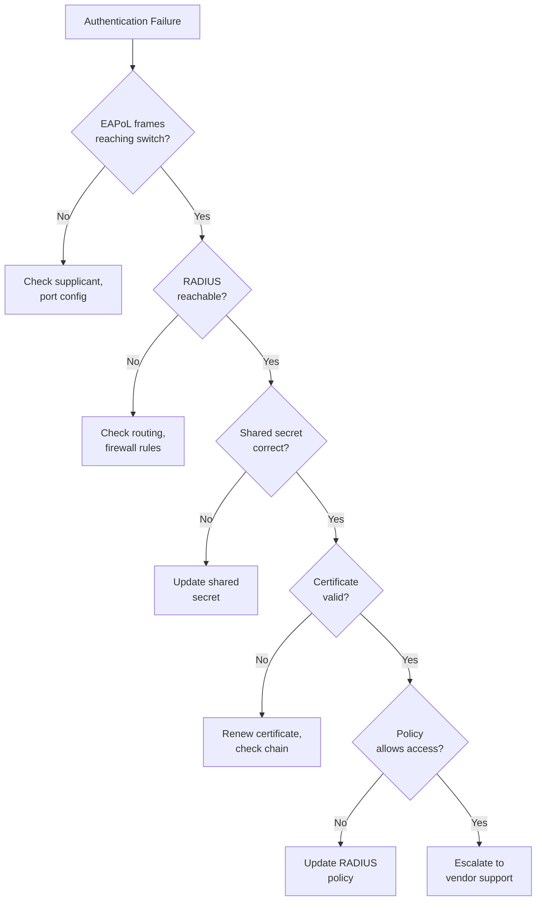

