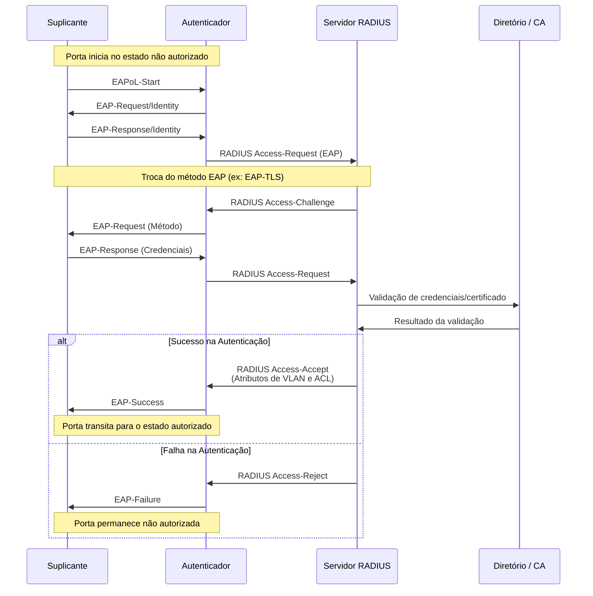
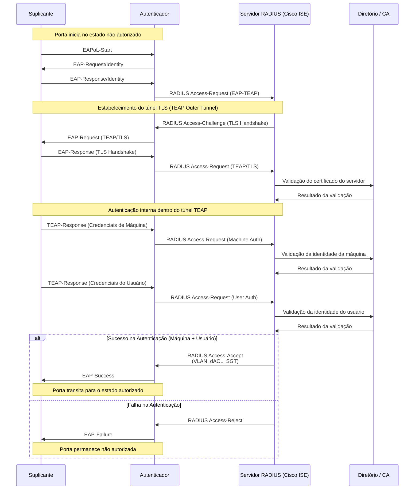
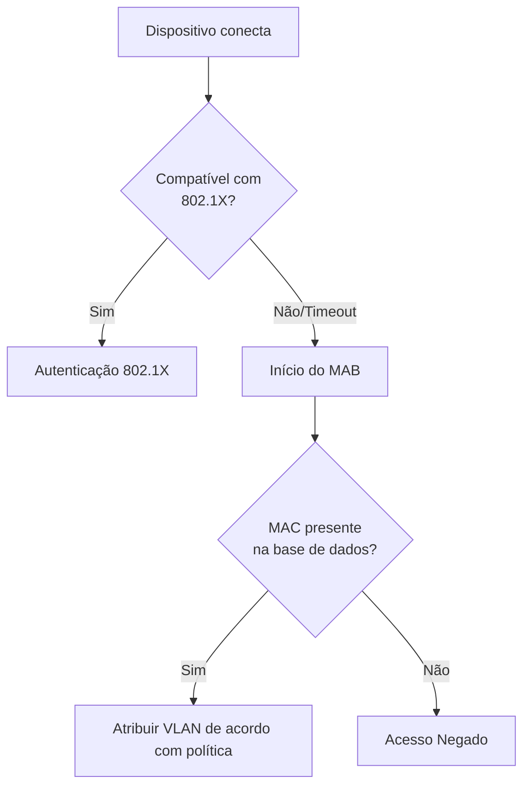
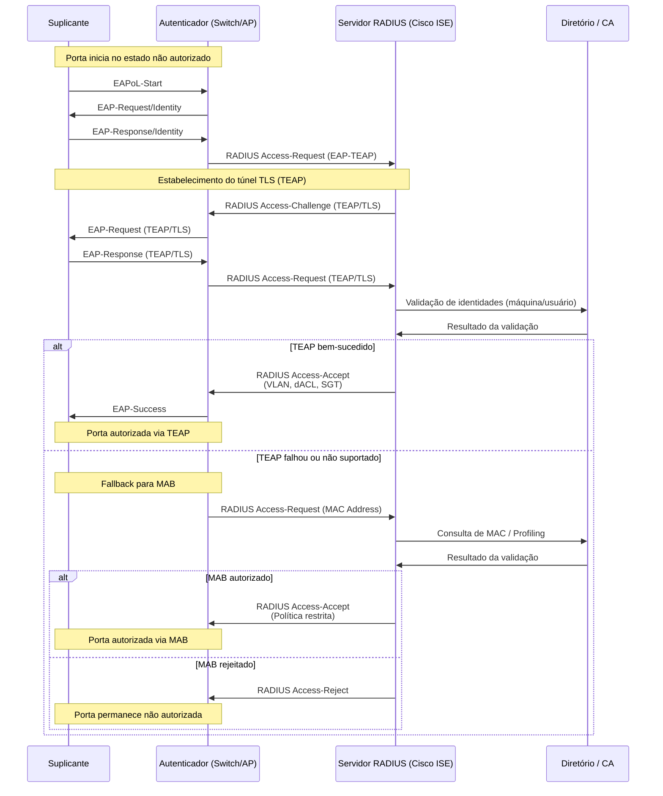

# Tipos de Autenticação

### Autenticação EAP-TLS

```mermaid
sequenceDiagram
    participant S as Suplicante
    participant A as Autenticador
    participant R as Servidor RADIUS
    participant D as Diretório / CA

    Note over S,A: Porta inicia no estado não autorizado
    S->>A: EAPoL-Start
    A->>S: EAP-Request/Identity
    S->>A: EAP-Response/Identity
    A->>R: RADIUS Access-Request (EAP)

    Note over S,R: Troca do método EAP (ex: EAP-TLS)
    R->>A: RADIUS Access-Challenge
    A->>S: EAP-Request (Método)
    S->>A: EAP-Response (Credenciais)
    A->>R: RADIUS Access-Request

    R->>D: Validação de credenciais/certificado
    D->>R: Resultado da validação

    alt Sucesso na Autenticação
        R->>A: RADIUS Access-Accept<br/>(Atributos de VLAN e ACL)
        A->>S: EAP-Success
        Note over S,A: Porta transita para o estado autorizado
    else Falha na Autenticação
        R->>A: RADIUS Access-Reject
        A->>S: EAP-Failure
        Note over S,A: Porta permanece não autorizada
    end
```

### Autenticação EAP-TEAP

```mermaid
sequenceDiagram
    participant S as Suplicante
    participant A as Autenticador
    participant R as Servidor RADIUS (Cisco ISE)
    participant D as Diretório / CA

    Note over S,A: Porta inicia no estado não autorizado

    %% Fase 1 - Estabelecimento do túnel TLS
    S->>A: EAPoL-Start
    A->>S: EAP-Request/Identity
    S->>A: EAP-Response/Identity
    A->>R: RADIUS Access-Request (EAP-TEAP)

    Note over S,R: Estabelecimento do túnel TLS (TEAP Outer Tunnel)
    R->>A: RADIUS Access-Challenge (TLS Handshake)
    A->>S: EAP-Request (TEAP/TLS)
    S->>A: EAP-Response (TLS Handshake)
    A->>R: RADIUS Access-Request (TEAP/TLS)

    R->>D: Validação do certificado do servidor
    D->>R: Resultado da validação

    %% Fase 2 - Autenticação interna (Inner Authentication)
    Note over S,R: Autenticação interna dentro do túnel TEAP

    S->>A: TEAP-Response (Credenciais de Máquina)
    A->>R: RADIUS Access-Request (Machine Auth)
    R->>D: Validação da identidade da máquina
    D->>R: Resultado da validação

    S->>A: TEAP-Response (Credenciais do Usuário)
    A->>R: RADIUS Access-Request (User Auth)
    R->>D: Validação da identidade do usuário
    D->>R: Resultado da validação

    %% Decisão de política
    alt Sucesso na Autenticação (Máquina + Usuário)
        R->>A: RADIUS Access-Accept<br/>(VLAN, dACL, SGT)
        A->>S: EAP-Success
        Note over S,A: Porta transita para o estado autorizado
    else Falha na Autenticação
        R->>A: RADIUS Access-Reject
        A->>S: EAP-Failure
        Note over S,A: Porta permanece não autorizada
    end
```

### MAC Authentication Bypass (MAB)

```mermaid
flowchart TD
    DEVICE[Dispositivo conecta] --> DOT1X{Compatível com<br/>802.1X?}

    DOT1X -->|Sim| AUTH[Autenticação 802.1X]
    DOT1X -->|Não/Timeout| MAB_START[Início do MAB]

    MAB_START --> MAC_CHECK{MAC presente<br/>na base de dados?}
    MAC_CHECK -->|Sim| ASSIGN[Atribuir VLAN de acordo com política]
    MAC_CHECK -->|Não| DENY[Acesso Negado]
```

### Autenticação EAP-TEAP + MAB

```mermaid
sequenceDiagram
    participant S as Suplicante
    participant A as Autenticador (Switch/AP)
    participant R as Servidor RADIUS (Cisco ISE)
    participant D as Diretório / CA

    Note over S,A: Porta inicia no estado não autorizado

    %% Fase 1 - Tentativa TEAP (802.1X)
    S->>A: EAPoL-Start
    A->>S: EAP-Request/Identity
    S->>A: EAP-Response/Identity
    A->>R: RADIUS Access-Request (EAP-TEAP)

    Note over S,R: Estabelecimento do túnel TLS (TEAP)
    R->>A: RADIUS Access-Challenge (TEAP/TLS)
    A->>S: EAP-Request (TEAP/TLS)
    S->>A: EAP-Response (TEAP/TLS)
    A->>R: RADIUS Access-Request (TEAP/TLS)

    %% Autenticação interna TEAP
    R->>D: Validação de identidades (máquina/usuário)
    D->>R: Resultado da validação

    alt TEAP bem-sucedido
        R->>A: RADIUS Access-Accept<br/>(VLAN, dACL, SGT)
        A->>S: EAP-Success
        Note over S,A: Porta autorizada via TEAP
    else TEAP falhou ou não suportado
        Note over S,A: Fallback para MAB

        %% Fase 2 - MAB
        A->>R: RADIUS Access-Request (MAC Address)
        R->>D: Consulta de MAC / Profiling
        D->>R: Resultado da validação

        alt MAB autorizado
            R->>A: RADIUS Access-Accept<br/>(Política restrita)
            Note over S,A: Porta autorizada via MAB
        else MAB rejeitado
            R->>A: RADIUS Access-Reject
            Note over S,A: Porta permanece não autorizada
        end
    end
```
